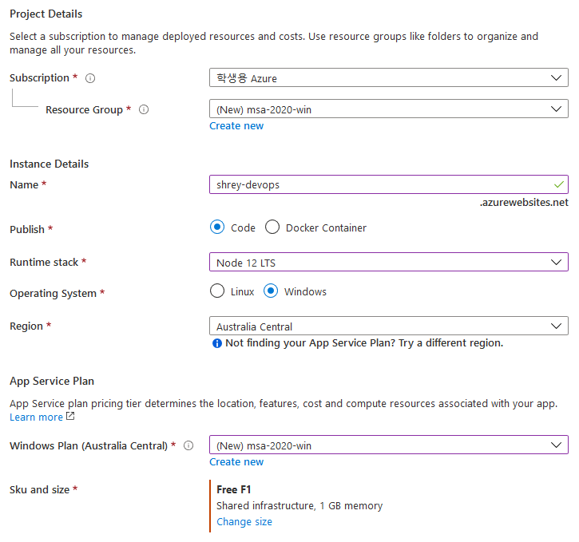

# DevOps <!-- omit in toc -->
This .README file contains the steps taken to complete the DevOps pathway. The prerequisites for this project is to have the latest version of Node installed on your computer. 

## Table Of Contents <!-- omit in toc -->
- [Create React Application](#create-react-application)
- [Initial Deployment](#initial-deployment)
- [Create Build Pipeline](#create-build-pipeline)
<hr>

## Create React Application
Using `npm`, which is the package manager for Node, we first need to install the boilerplate for react using the following command in our terminal.

```
npm install create-react-app
```

After this, we are ready to create our application so make a new repository on GitHub (with a .README), and then make a copy of it on your computer using the basic git commands. You should now be able to finally create a react application by running the following command in your root directory.

```
npx create-react-app my-app --template typescript
```
<hr>

## Initial Deployment
From your Azure Portal, we need to click on **Create a resource** and then select "Web App". Fill out the information of your application like shown in the image below.


After doing everything, click on "Review + Create" and then complete the wizard by clicking on "Create".
<hr>

## Create Build Pipeline
A build pipeline is the entity through which you define your automated build steps. First go to your Azure DevOps portal, and if you haven't already, create a free account using your Microsoft or GitHub account. Create an organization in which you can store many projects, and one or more of your pipelines. In that organization, create a private project with whatever name that suits your project.

Click on "Pipelines" on the left, and then select "Create Pipeline". If you are trying to create a pipeline for your code on GitHub, finish the rest of the process where you must select your repository and also give permissions to edit your code and make commits.
